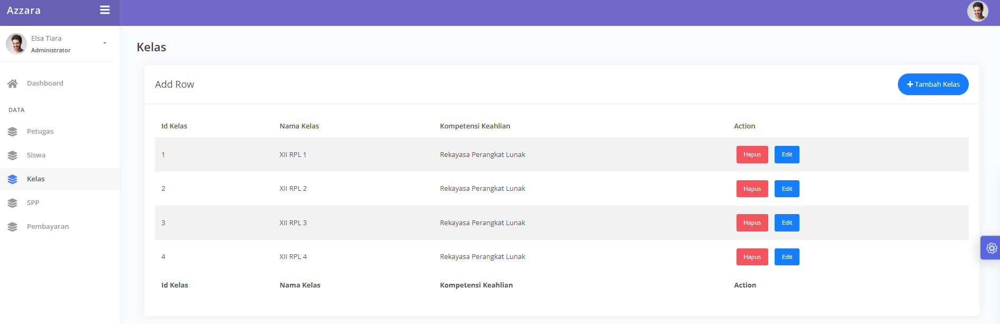

# 💸 node-SPP-paying

A simple backend web app for managing SPP (tuition) payments in schools. Built with Node.js, Express, MySQL, and EJS, it provides functionality for staff authentication, student data management, and SPP transaction handling.

---

## 🚀 Features

* 👤 Petugas Login System (with hashed passwords)
* 🧑‍🎓 CRUD for Siswa (Students)
* 💰 Manage SPP Payments
* 🔐 Protected Routes with Session-based Auth
* 🖥️ Dynamic Web Pages using EJS
* ⚙️ Modular Route and Controller Structure

---

## 🧰 Tech Stack

* Node.js + Express
* MySQL
* bcryptjs for password hashing
* express-validator for validation
* EJS templating engine
* dotenv (optional)

---

## ⚙️ Setup & Installation

### 1. Clone the Repository

```bash
git clone https://github.com/ndriuu/node-SPP-paying.git
cd node-SPP-paying
```

### 2. Install Dependencies

```bash
npm install
```

### 3. Setup the Database

* Open MySQL or phpMyAdmin
* Create a new database (e.g. `db_spp`)
* Import the file `db_spp` provided in the project folder

### 4. Configure the Database Connection

Edit the `config/db.js` file:

### 5. Start the App

```bash
node app.js
```

Visit the app at:

```
http://localhost:3000
```

---

## 🔑 Authentication

Login using available petugas data in your database. Example:

* Username: `elsa`
* Password: `123` (stored as bcrypt hash in DB)

---

## 📁 Project Structure

```
node-SPP-paying/
├── app.js
├── config/
│   └── db.js
├── controllers/
├── public/
├── routes/
├── views/
├── tes_perpus (1).sql
└── README.md
```

---

## 🖼️ EJS Templates

You can also showcase the appearance of each EJS view by adding screenshots here:

### 🖥️ Login Page


### 📊 Dashboard Page




You can customize these templates to change the UI layout and design of each page.

---

## 👨‍💻 Author

> Ghufron Andriansyah
> Created for learning and backend API development using Node.js

---

## 📌 Notes

* No frontend UI included (pure EJS)
* Passwords securely hashed using bcryptjs
* Session-based authentication (no JWT)
* Suitable for school projects and backend practice

---

## 📄 License

This project is open-source under the [MIT License](./LICENSE).
